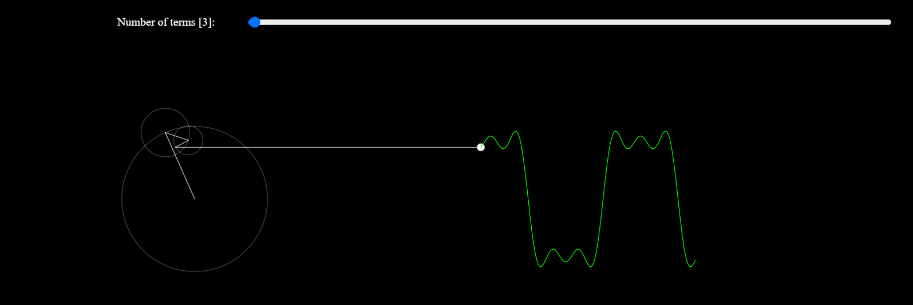

<h1 align='center'>Using p5.js</h1>

<a href="https://p5js.org/">p5.js</a> is JavaScript library aimed at simplifying canvas sketching and manipulation

<h2 align='center'>Epicycles</h2>

As we can see from the demo, a practical square wave can be obtained from summing sine waves, and this approximation gets better with increase in number of terms. Try for 9 terms vs 999 terms in the demo.

    

Demo available at <a href='https://pathakshashank17.github.io/p5'>gh-pages</a>