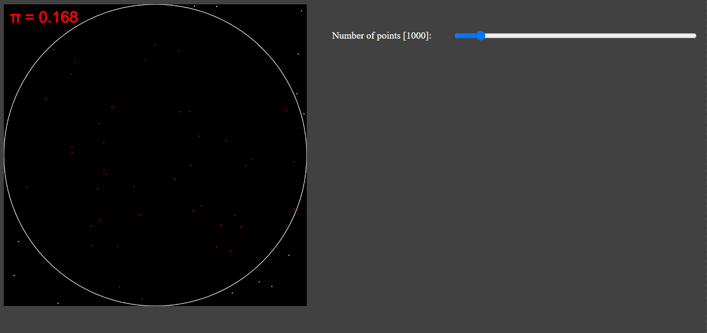
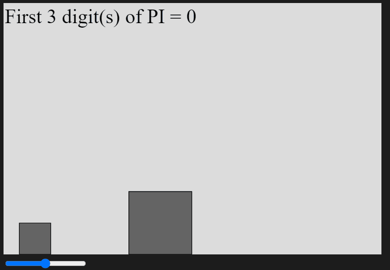

<h1 align='center'>Using p5.js</h1>

<a href="https://p5js.org/">p5.js</a> is JavaScript library aimed at simplifying canvas sketching and manipulation

<h2 align='center'>Epicycles</h2>

As we can see from the demo, a practical square wave can be obtained from summing sine waves, and this approximation gets better with increase in number of terms. Try for 9 terms vs 999 terms in the demo.

    

<h2 align='center'>Monte-Carlo method for finding π</h2>

 The idea behind this is draw a bunch of random points on the canvas and count the number of points falling inside the circle. The ratio of the number points inside the circle with the total number of points is equal to the ratio of the area of circle with the area of the canvas i.e π / 4

    

<h2 align='center'>Colliding Blocks method for finding π</h2>

In this method, two blocks, each with a mass ratio of 100^x, where x is an integer interact with each and a wall using elastic collision. The interesting fact is that the number of collisions gives us the digits in pi.

    

Demo available at <a href='https://pathakshashank17.github.io/p5'>gh-pages</a>
